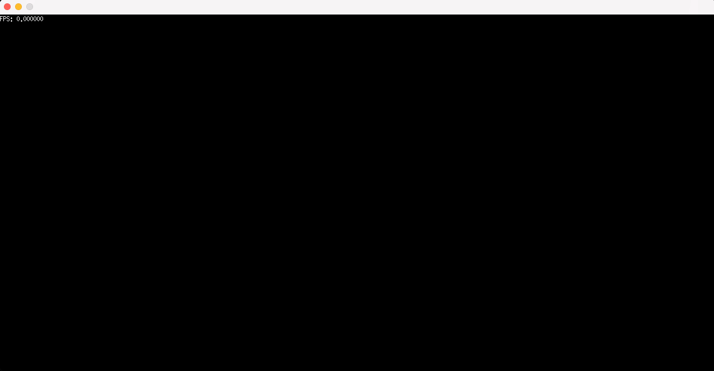

# CHIP-8 Virtual Machine in Go -- [Try it!](https://gochip-1082672001032.europe-west2.run.app/)

This project is a CHIP-8 virtual machine (interpreter) written in Go. The CHIP-8 is a simple, interpreted programming language from the 1970s, designed for easy game development on early computers. This virtual machine reads CHIP-8 ROMs and executes them, allowing you to play classic CHIP-8 games.



## Features

- Full CHIP-8 instruction set implementation
- Support for loading and running CHIP-8 ROM files
- 64x32 display resolution (for original CHIP-8)
- Basic input support via keyboard
- Timers (delay and sound)
- Simple, extensible codebase

## Getting Started

### Prerequisites

To run or modify this project, you need:

- [Go](https://golang.org/dl/) (version 1.18 or later)
- Docker (optional: if you want to run the web assembly version)

### Installing

1. Clone this repository to your local machine:
   ```bash
   git clone https://github.com/oliveira-a/gochip.git
   cd gochip
   ```

2. Install the necessary Go dependencies:
   ```bash
   go get .
   ```

3. Run the project
   ```bash
   go run .
   ```
### Web

1. Build the image
   ```bash
   docker build -t gochip -f server/Dockerfile .
   ```

2. Run the container
   ```bash
   docker run -i gochip
   ```

### Controls

- The CHIP-8 uses a 16-key hexadecimal keypad. The corresponding keys on your keyboard are:

```
1 2 3 4   -->  1 2 3 C
Q W E R   -->  4 5 6 D
A S D F   -->  7 8 9 E
Z X C V   -->  A 0 B F
```

- Use these keys to control games, as each game may have different key mappings.

