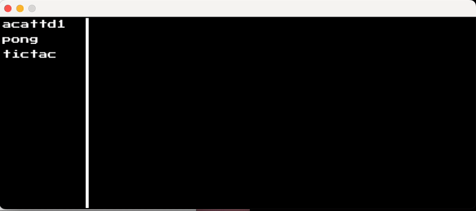

# CHIP-8 Virtual Machine in Go

This project is a CHIP-8 virtual machine (interpreter) written in Go. The CHIP-8 is a simple, interpreted programming language from the 1970s, designed for easy game development on early computers. This virtual machine reads CHIP-8 ROMs and executes them, allowing you to play classic CHIP-8 games.



## Features

- Full CHIP-8 instruction set implementation
- Support for loading and running CHIP-8 ROM files
- 64x32 display resolution (for original CHIP-8)
- Basic input support via keyboard
- Timers (delay and sound)
- Simple, extensible codebase

## Getting Started

### Prerequisites

To run or modify this project, you need:

- [Go](https://golang.org/dl/) (version 1.18 or later)
- A CHIP-8 ROM file (optional: there are many available online)

### Installing

1. Clone this repository to your local machine:
   ```bash
   git clone https://github.com/oliveira-a/gochip.git
   cd gochip
   ```

2. Install the necessary Go dependencies:
   ```bash
   go mod download
   ```

3. Build the project:
   ```bash
   go build ./cmd/desktop
   ```

### Usage

To run a CHIP-8 ROM with the virtual machine, use the following command:

```bash
./desktop <path-to-rom-file>
```

For example:

```bash
./desktop roms/pong.ch8
```

### Controls

- The CHIP-8 uses a 16-key hexadecimal keypad. The corresponding keys on your keyboard are:

```
1 2 3 4   -->  1 2 3 C
Q W E R   -->  4 5 6 D
A S D F   -->  7 8 9 E
Z X C V   -->  A 0 B F
```

- Use these keys to control games, as each game may have different key mappings.

### Configuration

You can configure various aspects of the CHIP-8 virtual machine, such as the CPU speed, display scaling, and more, by modifying the `config.go` file.

## Contributing

Feel free to fork this project and submit pull requests. Contributions for improving performance, adding new features, or fixing bugs are welcome!

### To contribute:

1. Fork the repository
2. Create a new branch (`git checkout -b feature/my-feature`)
3. Commit your changes (`git commit -am 'Add new feature'`)
4. Push to the branch (`git push origin feature/my-feature`)
5. Create a new Pull Request

## License

This project is licensed under the MIT License - see the [LICENSE](LICENSE) file for details.

## Acknowledgments

- Thanks to the [CHIP-8 community](https://en.wikipedia.org/wiki/CHIP-8) for their documentation and game resources.
- [Cowgod's CHIP-8 Technical Reference](http://devernay.free.fr/hacks/chip8/C8TECH10.HTM) was an invaluable resource during the development of this virtual machine.

---

Happy coding!

